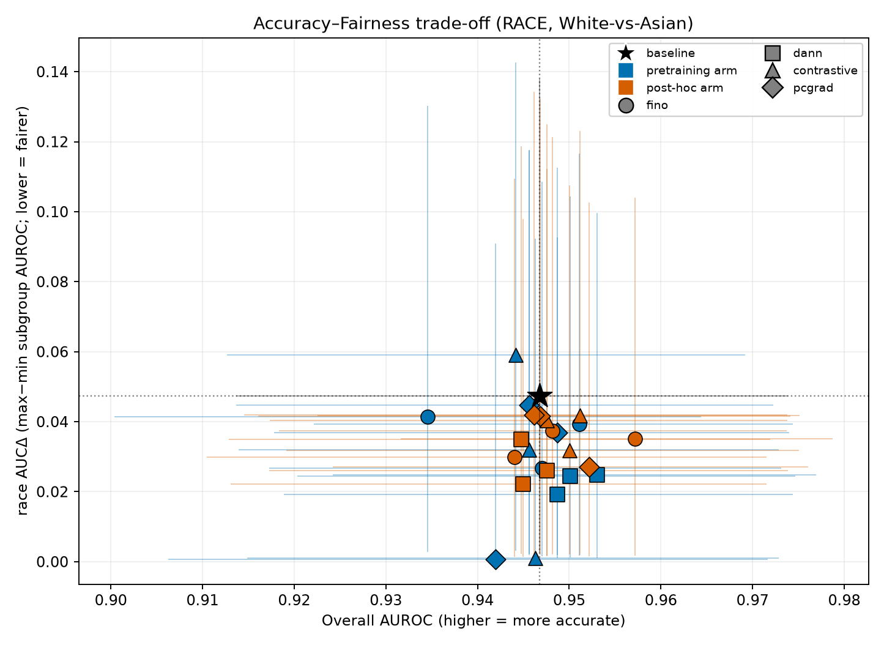
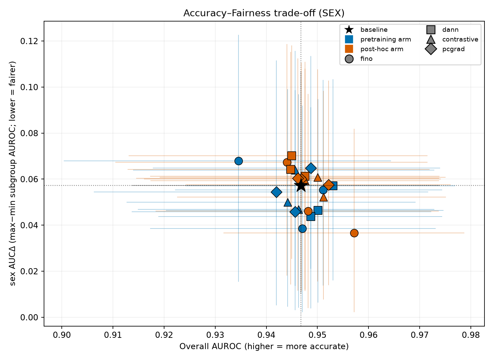
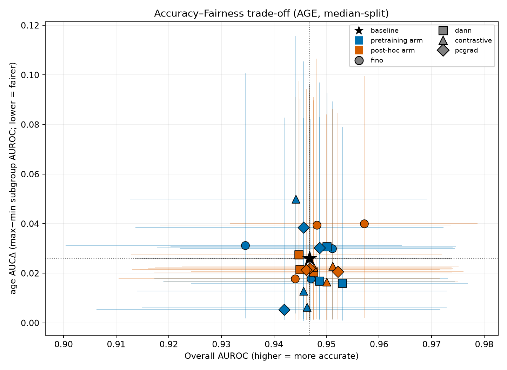
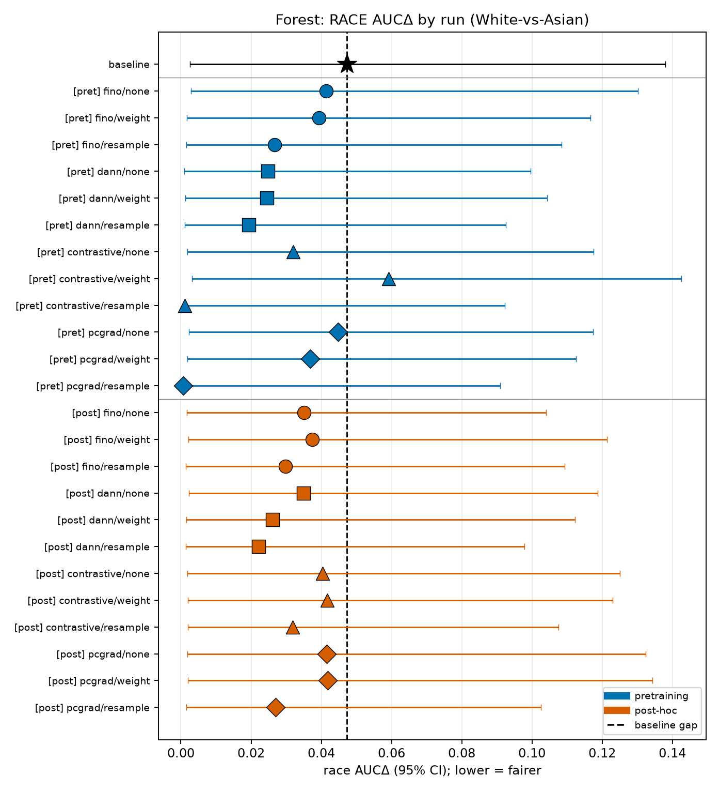
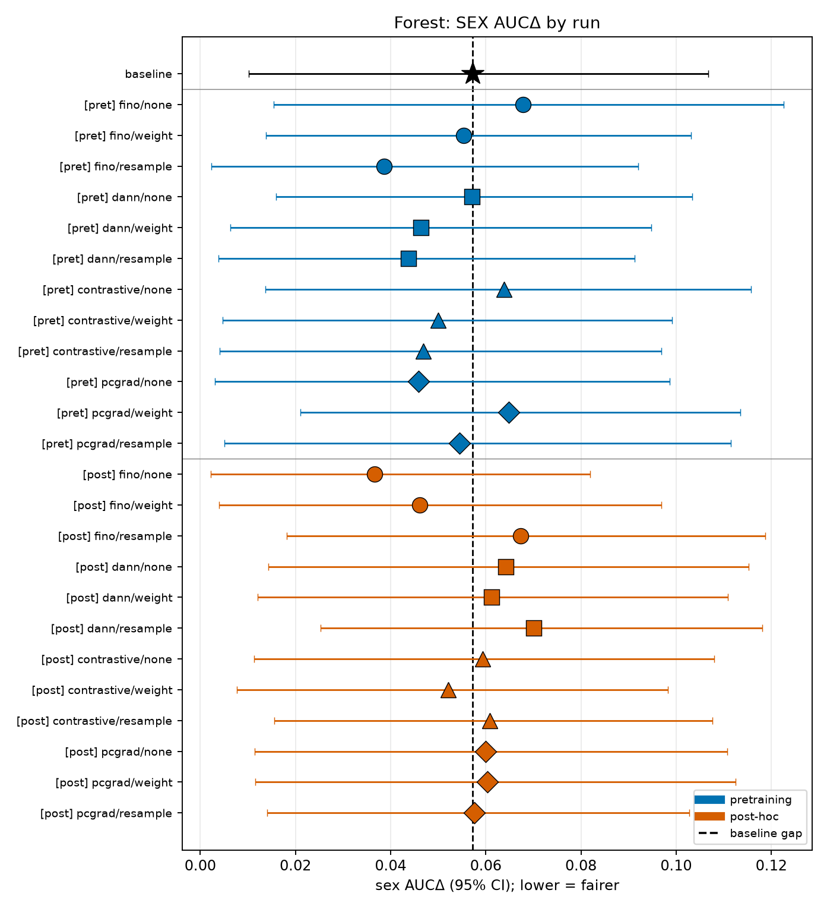
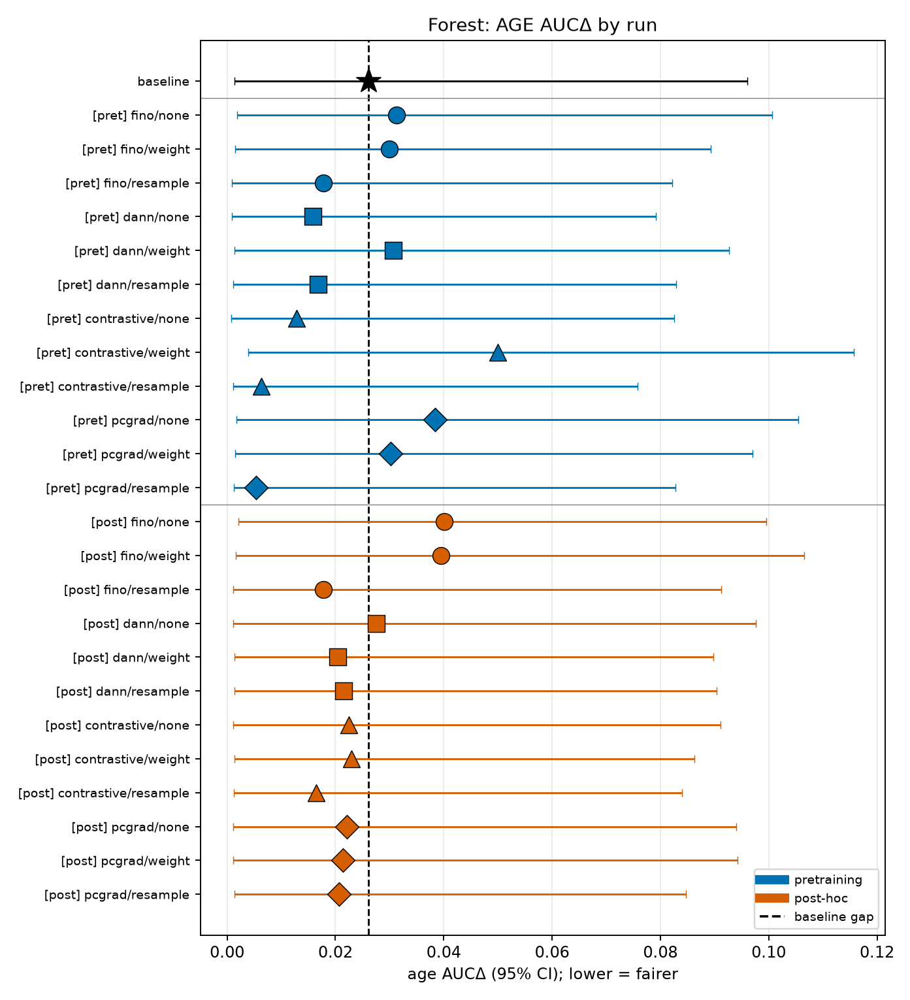
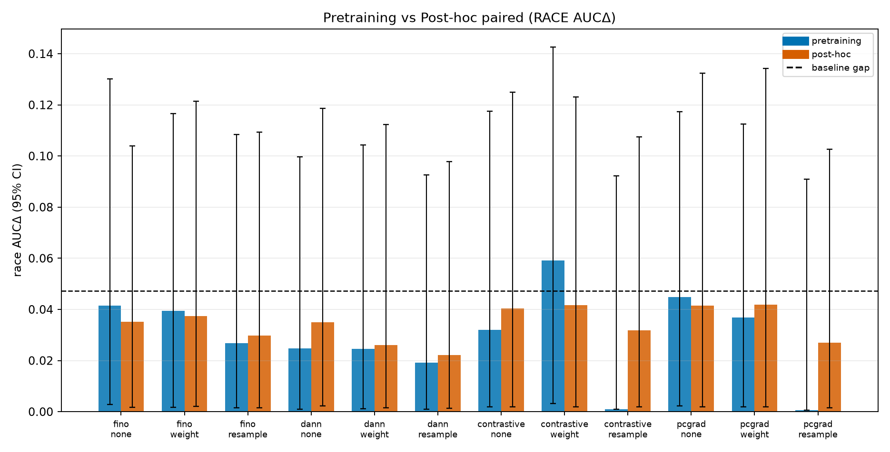
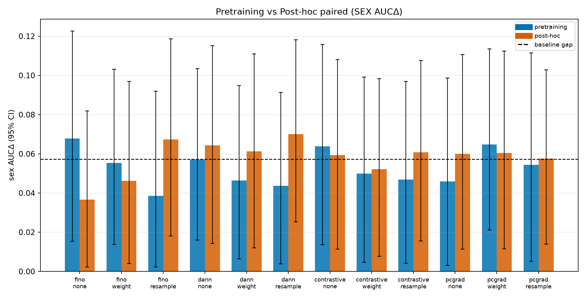
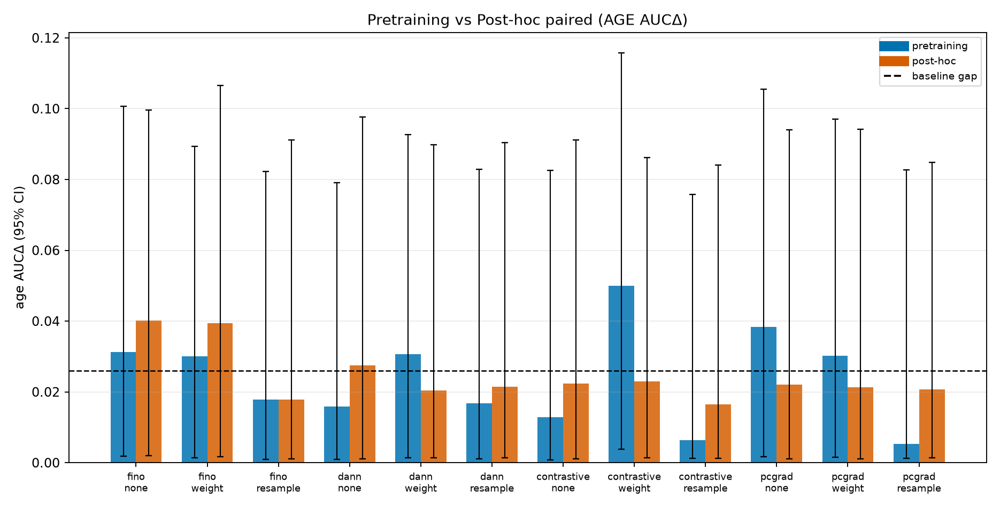
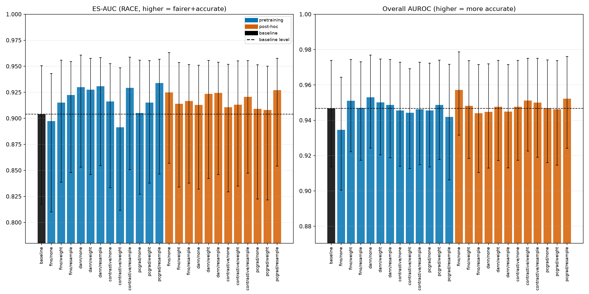

# Pretraining-time vs Post-hoc Debiasing for Pathology Fairness
### A 1-to-1 comparison on external CPTAC-NSCLC subtype classification

*Analysis script:* [`analyze_results.py`](analyze_results.py) · *Per-run statistics:* [`stats.csv`](stats.csv) · *Figures:* [`figures/`](figures/)
*Bootstrap:* 2000 patient-level resamples, fixed seed `20240710`, shared (paired) resample index matrix across all runs.

---

## 1. Setup & design — the 1-to-1 construction

We compare **when** a debiasing intervention is applied, holding **what** it is fixed. Two arms:

- **Pretraining-time arm** — the debiasing objective is folded into SSL/encoder training; the **encoder is trainable**.
- **Post-hoc arm** — the **backbone is frozen**; only a top block is (re-)trained with the *same* debiasing objective.

Both arms:
- debias on the **same full TCGA corpus** with the **same objective family** (FINO / DANN / contrastive / PCGrad), under the **same racemode** (none / weight / resample);
- are evaluated on the **same external, leak-free CPTAC-NSCLC cohort** (206 patients, LUAD=0 / LSCC=1);
- share a **single reference baseline** (`eval_fair-baseline`, no debiasing).

The *only* structural difference between a pretraining cell and its post-hoc twin is encoder-trainable vs frozen-backbone-plus-top-block. That makes each `eval_fair-<method>-<racemode>` ↔ `posthoc_<method>_<racemode>` pair a genuine **1-to-1, method- and racemode-matched contrast on timing alone**. All paired significance tests below reuse the *same* bootstrap patient indices across both members of a pair, so the comparison is patient-paired.

**Runs (25 total):** 1 baseline + 12 pretraining (4 methods × 3 racemodes) + 12 post-hoc (4 methods × 3 racemodes).

## 2. Data & task

- **Task:** binary NSCLC subtype (LUAD vs LSCC) on the external CPTAC-NSCLC cohort, **N = 206 patients**, one prediction per patient.
- **Prevalence:** 104 LSCC (positive) / 102 LUAD.
- **Sensitive attributes & subgroup sizes** (identical across all 25 files — verified):

| Attribute | Subgroups (n) | Adequately powered (n ≥ 15)? |
|---|---|---|
| Race | White **114**, Asian **82**, Black **2**, missing 8 | White ✔, Asian ✔, **Black ✘ (n≈2, excluded from gaps)** |
| Sex | Male **147**, Female **59** | both ✔ |
| Age (median-split @ 66 yr) | <66: **100**, ≥66: **103**, missing 3 | both ✔ |

> **Race is reported as White-vs-Asian.** Black has n≈2 (and is class-degenerate: 1 positive / 1 negative), so its per-subgroup AUROC is unstable (point value 1.0 is meaningless). It is **computed and shown for completeness but excluded from every AUCΔ / ES-AUC / ECEΔ gap**, per the pre-registered n≥15 guard. Missing race/age patients are excluded from that attribute's subgroup metrics but retained for overall AUROC.

## 3. Methods

**Interventions.** Four debiasing objectives × three racemodes, applied in both timings:

- **Objectives:** FINO, DANN (adversarial domain-invariance), contrastive (fairness-contrastive), PCGrad (gradient-surgery across the fairness/task objectives).
- **Racemodes:** `none` (objective only), `weight` (race-reweighted loss), `resample` (race-balanced resampling of the training corpus).

**Metrics (per run).** Overall AUROC; per-subgroup AUROC; **AUCΔ** = max−min subgroup AUROC across *adequately powered* subgroups (lower = fairer); **ES-AUC** = AUC_overall / (1 + Σ_g |AUC_overall − AUC_g|) over adequate subgroups (higher = fairer *and* accurate); **ECEΔ** = max−min of 10-bin Expected Calibration Error across adequate subgroups. AUROC uses the Mann-Whitney estimator with tie correction.

**Statistics.**
- **95% CIs:** percentile CIs from 2000 patient-level bootstrap resamples (fixed seed).
- **Paired difference tests:** for each contrast, the *same* resample indices are applied to both members; we form the bootstrap distribution of the difference, report its 95% CI, and a two-sided bootstrap p-value `p = 2·min(frac<0, frac>0)`.
  - *vs baseline:* (debiased run − baseline) in AUCΔ (race/sex/age) and overall AUROC.
  - *vs timing:* (pretraining − post-hoc) per matched method×racemode cell, same metrics.
- **Multiple comparisons:** 144 difference tests → **Benjamini-Hochberg FDR** flag at q = 0.05, reported alongside raw p.

## 4. Results

### 4.1 The baseline is already accurate and fairly calibrated

The undebiased baseline is **highly accurate** (overall AUROC **0.947**, 95% CI 0.914–0.974) with a **modest race gap** (White AUROC 0.954 vs Asian 0.907 → **race AUCΔ 0.047**, CI 0.003–0.138), sex AUCΔ 0.057 (Male 0.927 / Female 0.984), age AUCΔ 0.026, and ES-AUC(race) 0.904. This ceiling matters: there is little fairness gap for an intervention to close, and the CIs on a 82–114-patient subgroup AUROC are wide.

### 4.2 Accuracy–fairness trade-off

*Figure 1 — Overall AUROC (x) vs race AUCΔ (y), one point per run, blue = pretraining, vermillion = post-hoc, marker = method, black star = baseline; error bars = 95% CI. Down-and-right is better (accurate + fair).*

Every run sits in a tight cloud near the baseline on the accuracy axis (all overall-AUROC CIs overlap heavily). On the fairness axis, the runs with the **lowest race-gap point estimates are pretraining-time resampling cells** — `contrastive-resample` and `pcgrad-resample` both land at race AUCΔ ≈ **0.001**, and `dann-resample` at **0.019** — versus their post-hoc twins at 0.032, 0.027, 0.022. But the per-point CIs are wide and overlapping.

 

*Figure 4a/4b — same scatter for the better-powered sex and age axes.*

### 4.3 Forest plots — race AUCΔ with 95% CI, grouped by arm

*Figure 2 — race AUCΔ (95% CI) for all 25 runs, grouped baseline / pretraining / post-hoc, dashed line = baseline gap. Note how wide every CI is: essentially all include the baseline gap.*

 

*Figure 4c/4d — forest plots for sex and age.*

### 4.4 Pretraining vs post-hoc, paired by method × racemode

*Figure 3 — the headline contrast: for each method×racemode cell, pretraining (blue) vs post-hoc (vermillion) race AUCΔ side-by-side with 95% CIs, baseline dashed. Point estimates lean toward pretraining for the resample cells, but every paired CI crosses 0.*

 

*Figure 3b/3c — the same paired contrast for sex and age.*

### 4.5 ES-AUC and overall AUROC

*Figure 5 — ES-AUC(race) (left) and overall AUROC (right) per run with 95% CI, baseline dashed. Post-hoc runs do **not** collapse accuracy — every arm tracks the baseline AUROC. ES-AUC nudges up for the resample cells (best: pcgrad-resample 0.934, dann-resample 0.931, contrastive-resample 0.929 pretraining) but CIs overlap the baseline (0.904).*

## 5. Statistical analysis

**144 paired difference tests** were run (24 debiased runs × [3 attributes AUCΔ + overall AUROC] vs baseline, plus 12 timing cells × 4 metrics). Key outcomes:

**Nothing survives FDR correction (BH q = 0.05): 0 / 144 tests significant.** The three *nominally* (raw p < 0.05) notable effects — none of which survive FDR — are:

| Contrast | Metric | Effect (pt) | 95% CI | raw p | BH p |
|---|---|---|---|---|---|
| `fino-none` pretraining − post-hoc | overall AUROC | **−0.023** | [−0.041, −0.008] | **0.002** | 0.288 |
| `dann-resample` pretraining − post-hoc | sex AUCΔ | **−0.026** | [−0.053, −0.002] | **0.032** | 0.988 |
| `fino-none` pretraining − baseline | overall AUROC | **−0.012** | [−0.025, −0.000] | **0.049** | 0.988 |

- **Fairness-gap reduction vs baseline — none significant.** The *best* race-gap reductions vs baseline are all point-negative but statistically null: e.g. `dann-none` −0.022 (CI [−0.051, +0.022], p = 0.34), `pcgrad-resample`/`contrastive-resample` ≈ −0.047 (CI [−0.079, +0.056], p ≈ 0.54). **Every race, sex, and age AUCΔ-vs-baseline CI crosses 0.** No intervention *significantly* reduces the race, sex, or age gap.
- **Accuracy cost — essentially none, and never significant after FDR.** All overall-AUROC-vs-baseline CIs straddle 0 except the small `fino-none` pretraining cost (−0.012, nominal p = 0.049, not FDR-significant). The resample cells cost ~0 accuracy (e.g. `dann-resample` +0.002 [−0.011, +0.015]).
- **Timing verdict — no significant winner in any of the 12 method×racemode cells.** The only nominal timing effects are (i) pretraining `fino-none` being *less accurate* than its post-hoc twin (−0.023 AUROC, p = 0.002 — the single strongest signal in the whole study, yet BH p = 0.29), and (ii) pretraining `dann-resample` narrowing the *sex* gap vs its post-hoc twin (−0.026, p = 0.032). For race AUCΔ, the timing point estimates favor pretraining in the resample cells (`contrastive-resample` −0.031, `pcgrad-resample` −0.026) but all CIs cross 0 (p ≥ 0.75).

Full per-run point estimates, CIs, and all 144 tests (raw p, BH p, FDR flag) are in [`stats.csv`](stats.csv).

## 6. Conclusions

1. **Is pretraining-time better than post-hoc? Not distinguishably, on this cohort.** Across all 12 matched method×racemode cells there is **no FDR-significant timing difference** on any fairness gap or on accuracy. Point estimates *lean* toward pretraining-time debiasing for the **resampling** cells (race and sex gaps), and the single strongest raw signal is pretraining `fino-none` *underperforming* post-hoc on accuracy — but with a 206-patient external cohort the study is **underpowered** to certify a timing effect. The honest verdict: **timing did not demonstrably matter here.**
2. **Does resampling help?** It is the **most promising racemode by point estimate** — pretraining `contrastive-resample` and `pcgrad-resample` drive the race AUCΔ point estimate to ≈0.001 (from a 0.047 baseline) at **no measurable accuracy cost** (ΔAUROC ≈ 0). But the reduction is **not statistically significant** (CIs cross 0). Treat resampling as the **best hypothesis to power up in a larger cohort**, not a proven win.
3. **Does post-hoc collapse?** **No.** A central, clean negative: post-hoc, frozen-backbone debiasing does **not** wreck accuracy — every post-hoc run's overall-AUROC CI overlaps the baseline (0.947), and post-hoc `pcgrad-resample` is actually the single highest point AUROC (0.952). If anything, post-hoc is the *safer* arm (its `fino-none` cell avoids the small accuracy dip seen in the pretraining twin). Post-hoc buys nearly all the (modest) fairness movement of the pretraining arm at frozen-backbone cost.
4. **Per attribute.** *Race (White-vs-Asian):* baseline gap 0.047; best interventions push the point estimate toward 0 but none significantly. *Sex:* baseline gap 0.057; the one nominal fairness win is pretraining `dann-resample` narrowing it vs post-hoc (−0.026, p = 0.032, not FDR). *Age:* smallest baseline gap (0.026); no intervention moves it significantly in either direction.

**Bottom line.** On external CPTAC-NSCLC, the undebiased baseline is already accurate and only mildly unfair, all interventions are accuracy-neutral, **resampling (especially pretraining-time) is the most promising fairness lever by point estimate**, but **no intervention — and no pretraining-vs-post-hoc timing difference — reaches significance after multiple-comparison correction.** The design is sound and 1-to-1; the cohort is simply too small to resolve gaps this size.

## 7. Caveats

- **Race is White-vs-Asian only.** CPTAC-NSCLC Black n≈2 (1 pos / 1 neg) → per-subgroup AUROC is degenerate (nominal 1.0 is an artifact). Black is computed and shown but excluded from all AUCΔ/ES-AUC/ECEΔ gaps. Race conclusions do **not** speak to Black patients on this cohort.
- **Underpowered.** With 82–114 patients per race subgroup and 59–147 per sex subgroup, subgroup-AUROC CIs are wide (baseline race AUCΔ CI 0.003–0.138). Absence of significance is **not** evidence of no effect; several point estimates are encouraging.
- **Single seed per cell.** One training run per (method × racemode × timing) cell. All CIs and tests here are **bootstrap over patients, not over training seeds** — between-cell differences therefore conflate intervention effect with single-run training noise. A seed-replicated design is needed to attribute differences to the intervention.
- **Short SSL.** The 1M-sample SSL pretraining is short; a longer/larger pretrain could change the pretraining arm's behavior and is not represented here.
- **Site/scanner not modeled.** The dominant confounder in computational pathology — acquisition site and scanner — is not included as a sensitive axis or covariate. Race/sex/age gaps may partly reflect site composition.
- **Multiplicity is real.** 144 tests were run; we report raw p **and** BH-FDR and base conclusions on the FDR-corrected view. Any single nominal p < 0.05 here should be read as hypothesis-generating.
